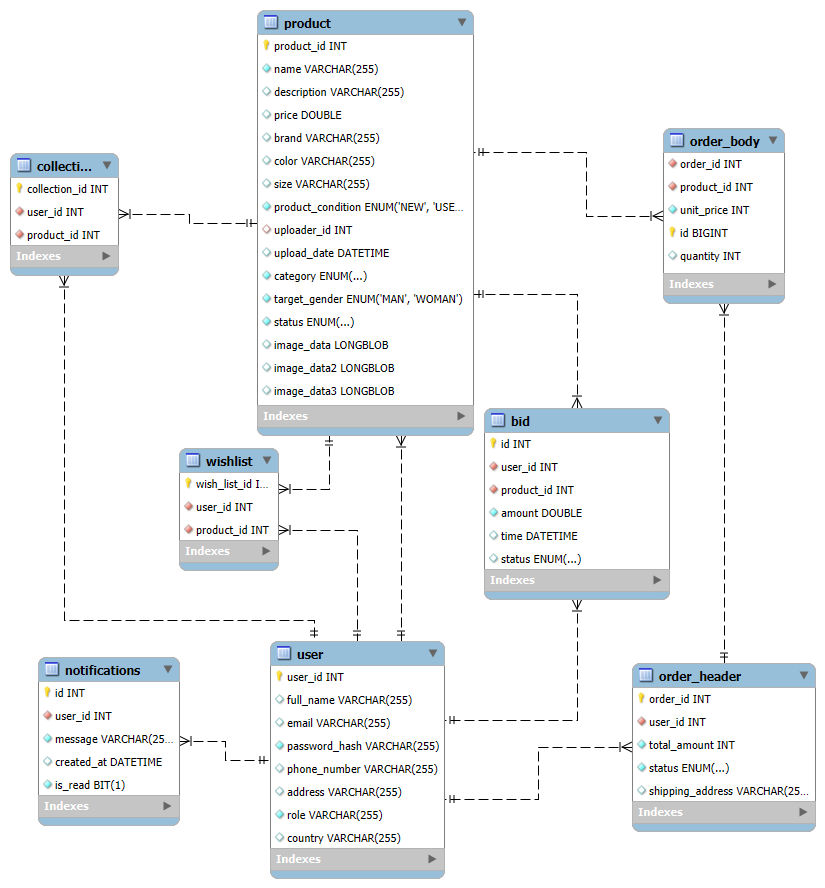

= LuxShop Backend Fejlesztői Dokumentáció
:toc: left
:toclevels: 3
:sectnums:

== 1. Funkcionális modell

A LuxShop egy online piactér, amely lehetőséget biztosít felhasználók számára prémium termékek feltöltésére, megvásárlására, illetve licitálására. A rendszer két fő szerepkört különböztet meg: **Adminisztrátor** és **Felhasználó**.

=== Szerepkörök

- *Adminisztrátor*: Jogosult termékek jóváhagyására, termékek kezelésére, valamint megrendelések státuszának módosítására.
- *Felhasználó*: Termékeket tölthet fel, vásárolhat, licitálhat, illetve kezelheti saját kosarát, kívánságlistáját és gyűjteményét.

=== Fő funkciók

- Regisztráció, bejelentkezés JWT-vel
- Termékfeltöltés képekkel
- Vásárlás (kosár + rendeléskezelés)
- Licitálás
- Admin termékjóváhagyás
- Értesítési rendszer
- Kívánságlista és kezelése

== 2. Technikai modell

A rendszer Spring Boot alapokon épül, REST architektúrával. A rétegek közötti elkülönítés tiszta és moduláris.

=== Szolgáltatások és interfészek

A `services` csomag tartalmazza az üzleti logikáért felelős osztályokat. Bizonyos szolgáltatások esetében (például `OrderService`) külön interfész (`OrderService`) és implementáció (`OrderServiceImpl`) került létrehozásra. Ez lehetővé teszi a jobb tesztelhetőséget, a logika könnyebb karbantartását és esetleges bővítését.

Más szolgáltatások, mint például a `BidService` vagy a `WishlistService`, egyelőre nem igényeltek külön interfészt. Ugyanakkor ezek is bővíthetők hasonló módon a jövőben.

A `repository` csomag felel az adatbázis-kezelésért. Ezek Spring Data JPA interfészek, mint például:
- `OrderHeaderRepository`
- `UserRepository`
- `ProductRepository`

Ezeket a service osztályok használják az adatok lekérdezéséhez és mentéséhez.

=== Rétegek

- `controller`: REST végpontok
- `service`: üzleti logika
- `repository`: adatbázis elérés
- `dto`: adatátviteli objektumok
- `model`: JPA entitások
- `exceptions`: egyedi kivételek (pl. érvénytelen műveletek hibakezelése)
- `enums`: felsorolt típusok (pl. termék állapotok, felhasználói szerepkörök)

=== Biztonság

- JWT-alapú hitelesítés
- `SecurityConfig.java` konfigurálja a védett és nyitott útvonalakat
- `CorsConfig.java` engedélyezi a frontendről érkező hívásokat

=== Főbb entitások

- `User`: id, full_name, email, password_hash, phone_number, address, country, role
- `Product`: id, name, description, price, imageData1-3,brand, color, size, uploader, uploadDate, category, targetGender, status
- `OrderHeader`, `OrderBody`: orderId, user, status, shippingAddress, items | id, order, product, quanitity, unitPrice
- `Bid`: id, amount, time, status, product, bidder
- `Notification`: id, user, message, timestamp, isRead

== 3. Interface (API) leírások

=== BidController

[cols="1,3,3,3,3"]
|===
| HTTP | Útvonal | Paraméterek | Visszatérési típus | Metódus
| POST | `/bids/place` | `@RequestBody BidRequestDTO bidRequest` | `ResponseEntity<?> placeBid` | `BidController`
| GET | `/bids/product/{productId}` | `@PathVariable Integer productId` | `ResponseEntity<List<BidDTO>> getBidsForProduct` | `BidController`
| POST | `/bids/accept/{bidId}` | `@PathVariable Integer bidId` | `ResponseEntity<?> acceptBid` | `BidController`
| POST | `/bids/reject/{bidId}` | `@PathVariable Integer bidId` | `ResponseEntity<?> rejectBid` | `BidController`
| GET | `/bids/user/{userId}` | `@PathVariable Integer userId` | `ResponseEntity<List<BidDTO>> getBidsByUserId` | `BidController`
| GET | `/bids/received/{uploaderId}` | `@PathVariable Integer uploaderId` | `ResponseEntity<List<BidDTO>> getReceivedBids` | `BidController`
|===

=== CollectionController

[cols="1,3,3,3,3"]
|===
| HTTP | Útvonal | Paraméterek | Visszatérési típus | Metódus
| GET | `/collection/{userId}` | `@PathVariable Integer userId` | `List<CollectionRead> getUserCollection` | `CollectionController`
|===

=== NotificationController

[cols="1,3,3,3,3"]
|===
| HTTP | Útvonal | Paraméterek | Visszatérési típus | Metódus
| GET | `/notifications/my` | `-` | `List<Notification> getMyNotifications` | `NotificationController`
| GET | `/notifications/unread-count` | `-` | `long getUnreadCount` | `NotificationController`
| PUT | `/notifications/mark-read` | `-` | `void markNotificationsAsRead` | `NotificationController`
|===

=== OrderController

[cols="1,3,3,3,3"]
|===
| HTTP | Útvonal | Paraméterek | Visszatérési típus | Metódus
| POST | `/orders/createOrder` | `@RequestBody OrderRequestDTO request` | `ResponseEntity<OrderResponseDTO> createOrder` | `OrderController`
| GET | `/orders/getOrderById/{id}` | `@PathVariable Integer id` | `ResponseEntity<OrderResponseDTO> getOrderById` | `OrderController`
| POST | `/orders/addToCart` | `@RequestBody AddToCartRequestDTO request` | `ResponseEntity<Void> addToCart` | `OrderController`
| GET | `/orders/getAllOrdersById/{user_id}` | `@PathVariable Integer user_id` | `ResponseEntity<List<OrderResponseDTO>> getOrdersByUserId` | `OrderController`
| GET | `/orders/getAllOrders` | `-` | `ResponseEntity<List<OrderResponseDTO>> getAllOrders` | `OrderController`
|===

=== ProductController

[cols="1,3,3,3,3"]
|===
| HTTP | Útvonal | Paraméterek | Visszatérési típus | Metódus
| GET | `/products/getProducts` | `-` | `List<Product> getProducts` | `ProductController`
| GET | `/products/getProductById/{id}` | `@PathVariable Integer id` | `ResponseEntity<ProductRead> getProductById` | `ProductController`
| DELETE | `/products/deleteProduct/{id}` | `@PathVariable Integer id` | `ResponseEntity<String> deleteProduct` | `ProductController`
| POST | `/products/approveProduct/{id}` | `@PathVariable Integer id` | `ResponseEntity<String> approveProduct` | `ProductController`
|===

=== UserManagementController

[cols="1,3,3,3,3"]
|===
| HTTP | Útvonal | Paraméterek | Visszatérési típus | Metódus
| POST | `/management/auth/register` | `@RequestBody RegisterRequest request` | `ResponseEntity<ReqRes> register` | `UserManagementController`
| POST | `/management/auth/login` | `@RequestBody LoginRequest request` | `ResponseEntity<ReqRes> login` | `UserManagementController`
| GET | `/management/adminuser/get-profile` | `-` | `ResponseEntity<ReqRes> getMyProfile` | `UserManagementController`
| GET | `/management/admin/get-all-users` | `-` | `ResponseEntity<List<User>> getAllUsers` | `UserManagementController`
| GET | `/management/admin/get-users/{userId}` | `@PathVariable Integer userId` | `ResponseEntity<User> getUserById` | `UserManagementController`
| PUT | `/management/user/update/{userId}` | `@PathVariable Integer userId, @RequestBody UserUpdateRequest request` | `ResponseEntity<User> updateUser` | `UserManagementController`
| GET | `/management/check-email` | `@RequestParam String email` | `ResponseEntity<Boolean> checkEmailExists` | `UserManagementController`
|===

=== WishlistController

[cols="1,3,3,3,3"]
|===
| HTTP | Útvonal | Paraméterek | Visszatérési típus | Metódus
| GET | `/wishlist/{userId}` | `@PathVariable Integer userId` | `List<WishlistRead> getWishlistById` | `WishlistController`
| POST | `/wishlist/addWishlistItem` | `@RequestBody WishlistSave wishlistSave` | `WishlistRead addToWishlist` | `WishlistController`
| DELETE | `/wishlist/removeWishlistItem` | `@RequestBody WishlistDelete wishlistDelete` | `ResponseEntity<String> removeFromWishlist` | `WishlistController`
|===

== 4. Adatbázis diagram

== 5. Fejlesztési lehetőségek

- Mobilalkalmazás fejlesztése Android/iOS-re
- Email értesítések vásárlásról, licitekről
- Online fizetés Bankártya vagy PayPal integrációval
