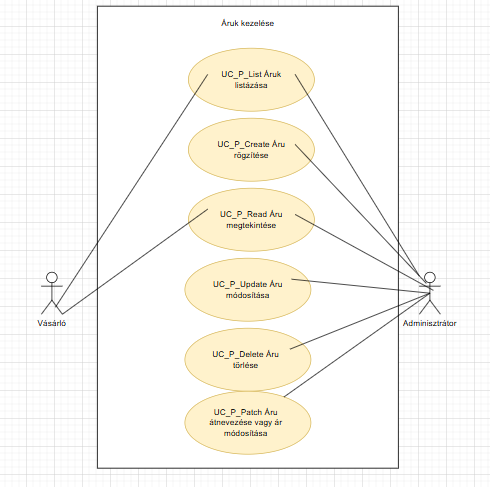

Funkcionális Modell

Leírás

A bejelentkezett felhasználó tudja listázni, megtekinteni, módosítani és törölni a webshop termékeit.

Használati esetek

Használati eset diagram

Használati esetek rövid leírása

Áruk listázása
[cols="1h,3"]
|===
| Azonosító
| UC_P_List

| Kiváltó esemény
| A felhasználó listázni kívánja az árukat

| Felhasználók
| Vásárló, Adminisztrátor

| Elsődleges lefutás
| 1. A felhasználó az Áruk listázása menüpontra kattint,
| 2. A rendszerben kiválogatásra kerülnek az áruk

| Kivételek és alternatívák
| -

| Utófeltétel
| A rendszerben az áruk listája előállt

| Eredmény
| A felhasználó látja az áruk listáját, kiválaszthat egyet közülük.

| Használati eset realizáció

|===

Áru rögzítése
[cols="1h,3"]
|===
| Azonosító
| UC_P_Create

| Kiváltó esemény
| A felhasználó új árut kíván rögzíteni

| Felhasználók
| Adminisztrátor

| Elsődleges lefutás
| 1. A felhasználó megadja az áru létrehozásához szükséges adatokat,
| 2. elindítja a rögzítés folyamatát,
| 3. A rendszerben rögzítésre kerül az új áru

| Kivételek és alternatívák
| (E.3. A megadott névvel már létezik áru a rendszerben)

| Utófeltétel
| A rendszerben az áru rögzítésre került

(E.3. A rögzítés nem történik meg, a felhasználó tájékoztatást kap a hibáról)

| Eredmény
| A felhasználó számára az imént rögzített áru elérhető a rendszerben.

| Használati eset realizáció
| Technikai modell

|===

Áru megtekintése
[cols="1h,3"]
|===
| Azonosító
| UC_P_Read

| Kiváltó esemény
| A felhasználó meg kívánja tekinteni a kiválasztott áru metaadatait

| Felhasználók
| Vásárló, Adminisztrátor

| Elsődleges lefutás
| 1. A felhasználó kiválasztja az árut,
| 2. A rendszerben lekérdezésre kerül a kiválasztott áru

| Kivételek és alternatívák
| -

| Utófeltétel
| A rendszerben az áru lekérdezésre került

| Eredmény
| A felhasználó látja a kiválasztott áru metaadatait

| Használati eset realizáció

|===

Áru módosítása
[cols="1h,3"]
|===
| Azonosító
| UC_P_Update

| Kiváltó esemény
| A felhasználó módosítani kívánja a kiválasztott áru metaadatait

| Felhasználók
| Adminisztrátor

| Elsődleges lefutás
| 1. A felhasználó megadja a módosítani kívánt adatokat,
| 2. elindítja a módosítás folyamatát,
| 3. A rendszerben módosításra kerül az áru

| Kivételek és alternatívák
| -

| Utófeltétel
| A rendszerben az áru módosításra került

| Eredmény
| A felhasználó látja az áru módosított metaadatait

| Használati eset realizáció
| Technikai modell

|===

Áru törlése
[cols="1h,3"]
|===
| Azonosító
| UC_P_Delete

| Kiváltó esemény
| A felhasználó törölni kívánja a kiválasztott árut a rendszer

| Felhasználók
| Adminisztrátor

| Elsődleges lefutás
| 1. A felhasználó elindítja a törlés folyamatát,
| 2. A rendszerben törlésre kerül az áru

| Kivételek és alternatívák
| (E.2. Vásárlásra előjegyzett áru nem törölhető)

| Utófeltétel
| A rendszerben az áru törlésre került

(E.2. Nem került törlésre az áru, a felhasználó tájékoztatást kap)

| Eredmény
| A felhasználó a továbbiakban nem látja a törölt áru metaadatait

| Használati eset realizáció

|===

Áru átnevezése vagy ár módosítása
[cols="1h,3"]
|===
| Azonosító
| UC_P_Patch

| Kiváltó esemény
| A felhasználó módosítani kívánja a kiválasztott áru valamelyik metaadatát

| Felhasználók
| Adminisztrátor

| Elsődleges lefutás
| 1. A felhasználó megadja az áru valamely metaadatának új értékét,
| 2. A rendszerben módosításra kerül az áru

| Kivételek és alternatívák
| -

| Utófeltétel
| A rendszerben az áru módosításra került

| Eredmény
| A felhasználó látja az áru módosított metaadatait

| Használati eset realizáció

|===

Jogosultságok

[cols="1,1,1"]
|===
| Használati eset | Jogosultság | Szerepkörök

| Áruk listázása
| PROD_LIST
| Vásárló, Adminisztrátor

| Áru rögzítése
| PROD_CREATE
| Adminisztrátor

| Áru megtekintése
| PROD_READ
| Vásárló, Adminisztrátor

| Áru módosítása
| PROD_UPDATE
| Adminisztrátor

| Áru törlése
| PROD_DELETE
| Adminisztrátor

| Áru névváltozása vagy ár módosítása
| PROD_PATCH
| Adminisztrátor

|===

A felületen lévő mezők

[cols="1,1,1,1,1"]
|===
| Megnevezés | Típus | Kötelező | Szerkeszthető | Megjelenés

| Áru neve
| Szöveges input mező
| I
| I
| Szűrő ablakrész

| Áru ára
| Szám típusú input mező
| I
| I
| Szűrő ablakrész

| Áru fajtája
| Címke
| -
| -
| Találati lista ablakrész

| Áru ára
| Címke
| -
| -
| Találati lista ablakrész

|===

A felületről elérhető műveletek

[cols="1,1,1"]
|===
| Esemény | Leírás | Jogosultság

| A Keresés gombra kattintás
| Végrehajtásra kerül az Áruk listázása használati eset. A találati listában megjelennek a kiválogatott áruk.
| PROD_LIST

| A Megtekintés gombra kattintás
| Végrehajtásra kerül az Áru megtekintése használati eset. A felhasználó a megtekintő felületre jut.
| PROD_READ
|===

Áru rögzítése vagy szerkesztése felület

A felületen lévő mezők

[cols="1,1,1,1,1"]
|===
| Megnevezés | Típus | Kötelező | Szerkeszthető | Validáció

| Áru neve
| Szöveges input mező
| I
| I
|

| Áru ára
| Szám típusú input mező
| I
| I
|

| Áru kategória
| Lenyíló lista
| I
| I
| Felvehető értékek: ["Elektromos", "Ruházat", "Kiegészítők"]

| Áru súlya
| Szám típusú input mező
| N
| I
| 1 tizedesjegy pontosságú pozitív valós szám

|===

A felületről elérhető műveletek

[cols="1,1,1,1"]
|===
| Esemény | Leírás | Felület | Jogosultság

| A Mentés gombra kattintás
| Végrehajtásra kerül az Áru rögzítése használati eset. A felhasználó az áru megtekintése felületre jut.
| Áru létrehozása felület
| PROD_CREATE

| A Mentés gombra kattintás
| Végrehajtásra kerül az Áru módosítása használati eset. A felhasználó az áru megtekintése felületre jut.
| Áru módosítása felület
| PROD_UPDATE
|===

Áru megtekintése felület

A felületen lévő mezők

[cols="1,1"]
|===
| Megnevezés | Típus

| Áru neve
| Szöveges címke

| Áru ára
| Szám típusú címke

| Áru fajtája
| Szöveges címke

| Áru kategória
| Szöveges címke

| Áru súlya
| Szám típusú címke 1 tizedesjegy pontossággal. Mértékegység gramm.

|===

A felületről elérhető műveletek

[cols="1,1,1"]
|===
| Esemény | Leírás | Jogosultság

| A Szerkesztés gombra kattintás
| A felhasználó az áru szerkesztése felületre jut.
| -

| A Törlés gombra kattintás
| Megjelenik egy párbeszédablak.
| -
|===

link:../functional-models.adoc[Vissza]